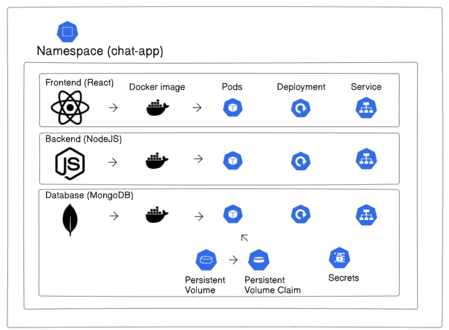
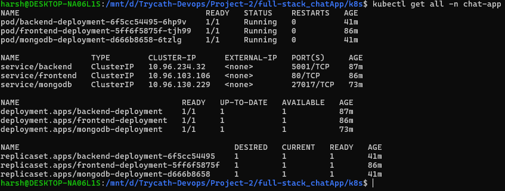

# 🧱 Chat App - Three Tier Kubernetes Deployment on KIND

This project demonstrates the deployment of a **three-tier full-stack chat application** on a local Kubernetes cluster using [**kind** (Kubernetes IN Docker)](https://kind.sigs.k8s.io/). The application includes:

- **Frontend** (React)
- **Backend** (Node.js + Express)
- **Database** (MongoDB)

All components are containerized and orchestrated using Kubernetes manifests, with persistent storage, secrets, and namespace isolation.

---

## 📦 Project Structure

├── backend-deployment.yml
├── backend-service.yml
├── frontend-deployment.yml
├── frontend-service.yml
├── mongodb-deployment.yml
├── mongodb-service.yml
├── mongodb-pv.yml
├── mongodb-pvc.yml
├── namespace.yml
├── secrets.yml
└── README.md

## 📊 Architecture Diagram



---

## 🚀 Prerequisites

Make sure you have the following tools installed:

### 🐳 Docker

Install Docker:  
👉 [https://docs.docker.com/get-docker/](https://docs.docker.com/get-docker/)

---

### 🛠️ Install `kubectl`

Follow the guide for your OS:  
👉 [https://kubernetes.io/docs/tasks/tools/](https://kubernetes.io/docs/tasks/tools/)

Or use the quick setup (Linux/macOS):

```bash
# Download the latest release
curl -LO "https://dl.k8s.io/release/$(curl -L -s https://dl.k8s.io/release/stable.txt)/bin/$(uname | tr '[:upper:]' '[:lower:]')/amd64/kubectl"

# Make it executable
chmod +x kubectl

# Move it to your PATH
sudo mv kubectl /usr/local/bin/

# Verify installation
kubectl version --client

- Docker 🐳
- [kind](https://kind.sigs.k8s.io/) (Kubernetes IN Docker)
- kubectl

---

## ⚙️ Setup Instructions
=========================================
Install using the commands below:

# Download the latest kind binary
curl -Lo ./kind https://kind.sigs.k8s.io/dl/latest/kind-$(uname)-amd64

# Make it executable
chmod +x ./kind

# Move it to a directory in your PATH
sudo mv ./kind /usr/local/bin/

# Verify installation
kind version
=========================================

### 1. Create a KIND Cluster

kind create cluster --name chat-cluster


### 2. Create a Namespace

kubectl apply -f namespace.yml

### 3. Create Kubernetes Secrets

kubectl apply -f secrets.yml

### 4. Create Persistent Volume and Claim for MongoDB

kubectl apply -f mongodb-pv.yml
kubectl apply -f mongodb-pvc.yml

### 5. Deploy MongoDB

kubectl apply -f mongodb-deployment.yml
kubectl apply -f mongodb-service.yml

### 6. Deploy Backend

kubectl apply -f backend-deployment.yml
kubectl apply -f backend-service.yml

### 7. Deploy Frontend

kubectl apply -f frontend-deployment.yml
kubectl apply -f frontend-service.yml

📡 Access the Application
To access the frontend from your local machine, use kubectl port-forward:

kubectl port-forward service/frontend 8080:80 -n chat-app

Then open your browser and navigate to:
http://localhost:8080

🔐 Environment & Secrets
MongoDB credentials are passed via environment variables.

JWT secret is stored as a Kubernetes secret (Opaque) and referenced in the backend deployment.

All components reside in a dedicated namespace: chat-app.

🛠 Tech Stack
Frontend: React (port 80)

Backend: Node.js + Express (port 5001)

Database: MongoDB (port 27017)

Orchestration: Kubernetes (manifests)

Local Cluster: kind

Secrets Management: Kubernetes Secret

📸 Screenshots


kubectl get all -n chat-app


📘 Notes
This project is ideal for:

- Learning Kubernetes fundamentals

- Deploying multi-tier containerized apps

- Working with secrets, volumes, and namespaces

💡 Future Enhancements
- Add Ingress for external access

- Introduce ConfigMaps for configuration

- Implement Horizontal Pod Autoscaler (HPA)

- Setup CI/CD pipeline for automated deployments